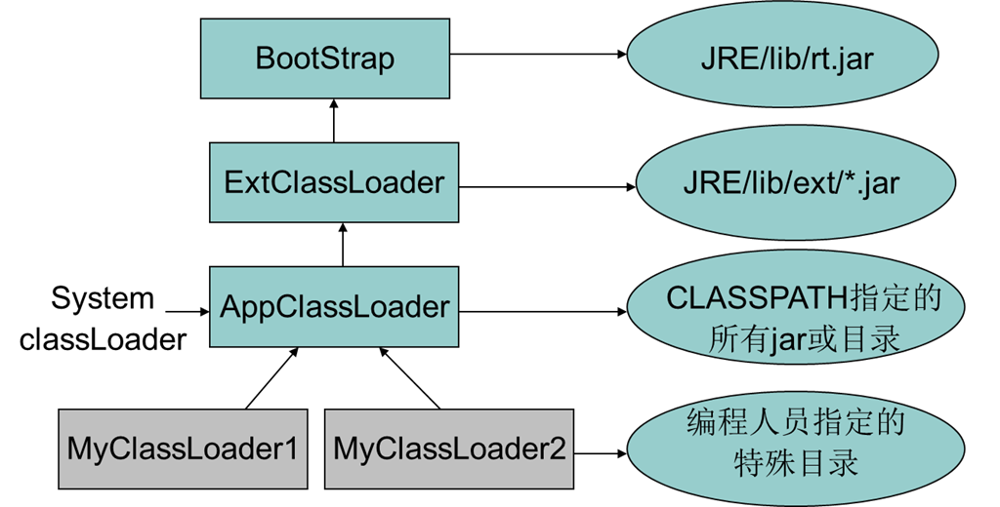

# SpringBoot

Spirng Boot 自定义初始化控制台展示图形界面
* 使用的是Spring Boot 中的banner
* SpringBoot 1.3.5版本以上已经禁用`spring.main.show-banner=true`
* 在`resource`文件夹下面创建一个`banner.txt` 文件里面放你要展示的字符

**SpringBoot之JPA**

```xml
    <dependency>
      <groupId>org.springframework.boot</groupId>
      <artifactId>spring-boot-starter-data-jpa</artifactId>
    </dependency>
```
- JPA测试

```java
    //注入Entity Manager，类似Hibernate的session和Mybatis的SqlSession 
   @RunWith(SpringJUnit4ClassRunner.class)
   @SpringBootTest(classes = Runner.class)
   public class JpaTest {
    @Autowired
    private EntityManager entityManager;
    @Test
    public void findStuById(){
       String sql = "select sid,sname,sage,email,time,endtime,ssex from stu";
        Query query = entityManager.createNativeQuery(sql, Student.class);
        List<Student> resultList = query.getResultList();
        for (int i = 0; i < resultList.size(); i++) {
            System.out.println("学生：" + resultList.get(i).getStuName());
        }

    }
   }
```
# JavaBase
### javabasic

 实现线程的两种方式
 * 继承Thread类
 * 实现Runnable接口， 因为Thread类也实现Runnable接口
实现Runnable接口的好处

      1）：适合多个相同的程序代码的线程去处理同一个资源
      2）：可以避免java中的单继承的限制
      3）：增加程序的健壮性，代码可以被多个线程共享，代码和数据独立
      4）：线程池只能放入实现Runable或callable类线程，不能直接放入继承Thread的类
           


1. 新建状态(New)： 新创建了一个线程对象
2. 就绪状态(Runnable)： 线程对象创建后，其他线程调用了该对象的`start()` 方法。该状态的线程位于可运行线程池中，变的可运行，等待获取CPU的使用权
3. 运行状态(Running)： 就绪状态的线程获取了CPU，执行程序代码
4. 阻塞状态(Blocked)： 阻塞状态是线程因为魔种原因防区CPU的使用权，暂停停止运行。知道线程进入就绪状态，才能有机会转到运行状态
    * 等待阻塞： 运行的线程执行`wait()` 方法，JVM会把该线程放入等待池中。(wait会释放所有的锁)
    * 同步阻塞： 运行的线程在获取对象的同步锁时，若同步锁被别的线程占用，则JVM吧该线程放入锁池中
    * 其他阻塞： 运行的线程执行`sleep()或join()` 方法，或者发出了I/O请求时，JVM会把该线程置为阻塞状态，当`sleep()` 状态超时、`join()`等待线程种植或者超时、或者I/O处理完毕时，线程重新转入就绪状态
5. 死亡状态(Dead)： 线程执行完了或者因一场退出了`run()`方法，该线程结束生命周期。

**反射**
实现反射的三种方法
1. 类名.getClass()
2. 对象名.getClass()
3. Class.forName(类名字);

利用反射进行读取配置文件
* 使用类加载器进行加载配置文件`类名.class.getClassLoader().getResourceAsStream(str)`;
    
### 类加载器
把classpath下的那些.class文件加载进内存，处理后成为字节码，这些工作是类加载器做的。

- **委托机制**指的是将加载类的请求传递给父加载器，如果父加载器找不到或者不能加载这个类，那么再加载他。
- **可见性机制**指的是父加载器加载的类都能被子加载器看见，但是子加载器加载的类父加载器是看不见的。
- **单一性机制**指的是一个类只能被同一种加载器加载一次。

**默认类加载器**
系统默认三个类加载器:

- `BootStrap`
- `ExtClassLoader`
- `AppClassLoader`



一般加载类的顺序：

- 首先当前线程的类加载器去加载线程中的第一个类
- 如果类A应用了类B，java虚拟机将使用加载类A的类加载器来加载类B
- 还可以直接调用ClassLoader.loadClass()方法来制定某个类加载器去加载某个类


